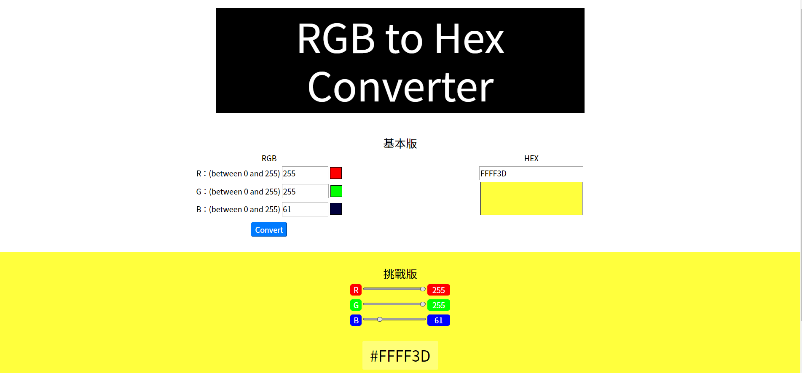

# RGB to Hex Converter
一個 RGB 與 HEX 色碼的轉換器，支援 "輸入值" 與 "拖曳" 兩種版面。  
[Github Page link](https://lianginger.github.io/rgb-to-hex-converter)

## 網站截圖

## 規格
- 基本版：  
按下 Convert 按鈕之後，畫面才會 Hex 色碼與預覽顏色。提醒記得做例外處理：1) RGB 輸入值為空 2) RGB 輸入值不是 0~255 的數字
- 挑戰版：  
在拖曳 slider 的同時，就可以看見 Hex 色碼與預覽顏色。
  
